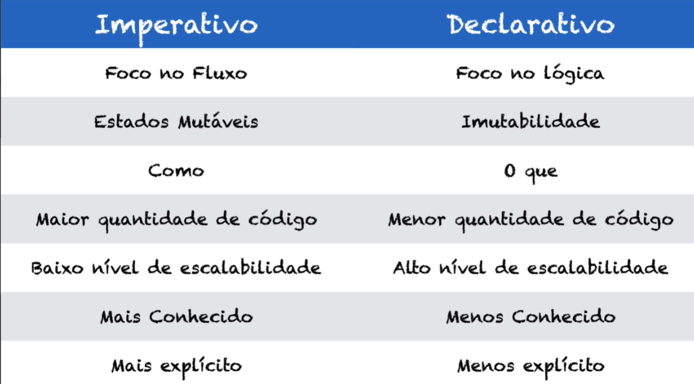

<h1>Paradigmas de Programação</h1>

<h2>Conceitos:</h2>

<strong> - Paradigma:</strong> Modelo ou padrão que deve ser seguido.

<O><strong>Código Declarativo VS Código Imperativo:</strong> O Imperativo é o mais comum e o mais popular, e é a base da programação Procedural e Orientada a Objeto (OO). Ela tem o foco no fluxo, isso faz com que você escreva muito sobre como as coisas devem serem feitas. <strong>O Declarativo foca mais na lógica e no objetivo final, no OQUE</strong>.

O Imperativo trabalha com dados mutáveis, já no Declarativo o foco é dados imutáveis, você não altera os dados existentes, você cria novos dados como evolução do já existente. Isso dá uma vantagem de trabalhar com multiprocessamento. O código Imperativo está sempre modificando e mexendo nas variáveis.

<strong>O Imperativo tem o foco no COMO,</strong> em explicar como deve ser feito, já o Declarativo ele foca no O QUE precisa ser feito, o ‘como’ ele deixa para linguagem resolver. O Imperativo tem uma maior quantidade de código, pois você precisa explicar exatamente o fluxo de funcionamento, no Declarativo há uma menor quantidade.

Um exemplo grosseiro: Imagine que você peça a um funcionário pagar uma conta, no Declarativo, você apenas daria o valor ou papel ao seu funcionário contendo o saldo, e o funcionário que se encarregaria de fazer o caminho até a lotérica e realizar o pagamento, depois ele lhe mostraria o comprovante. Ou seja você disse que apenas queria pagar a conta, e passou o parâmetro de entrada, o papel com o valor, e o funcionário te retorna com o objeto que queria, o comprovante da conta paga.

Já no Imperativo, você diria a ele para pagar a conta, e descreveria a ele como fazer isso, diria o caminho a percorrer e como agir, por exemplo: (pegar o papel, descer do prédio pelo elevador, andar na rua tal, atravessar a rua a partir do ponto x, entrar na lotérica, etc.) após tudo isso o funcionário segue o que você passou a ele, e te traz o comprovante de pagamento. Notou a diferença? Você diz como deve ser feito.

No imperativo há um baixo nível de escalabilidade, o Declarativo possui um alto nível, isso devido ao multiprocessamento. O Imperativo é mais explícito, pois o seu funcionamento, o COMO está bem visível. O Declarativo é mais implícito, pois você vê pouco código que faz bastante coisa por baixo dos panos. O Imperativo é um código menos recusável, mas com maior velocidade de execução, o Declarativo é um código mais recusável e menos veloz. Porem é bom lembrar que o maior gargalo comparando os dois, não é o desempenho, e sim um problema de código mau escrito.

<strong> - Programação Funcional:</strong> A programação funcional é um dos muitos paradigmas para o desenvolvimento de sistemas e traz uma série de possibilidades para pessoas programadoras.Podemos simplificar dizendo que um código escrito sob um paradigma funcional é composto de múltiplas funções, que trabalham de forma unificada para a resolução de um problema.

<strong>
Características da programação funcional:
</strong>

<i> - Composição de funções:</i> criar uma nova função através da composição de outras. Por exemplo, vamos criar uma função que vai filtrar um array, filtrando somente os números pares e multiplicando por dois:

<code>
const numeros = [2, 3, 4, 5, 6, 7, 8, 9, 10]

numeros.filter((numero) => numero % 2 === 0).map((numero) => numero * 2) 
// [ 4, 8, 12, 16, 20 ]
</code>

<i> - Funções puras:</i> Uma função é chamada pura quando invocada mais de uma vez produz exatamente o mesmo resultado. Isto é, o retorno da função é sempre o mesmo se você passar os mesmos parâmetros, então ela não pode depender de valores mutáveis. Por outro lado, ela não pode causa efeitos colaterais externos, pois se ela imprime uma linha de saída, altera algo no banco, lança um foguete para o espaço, ao invocá-la a segunda vez ela vai causar um novo efeito.

Exemplo:

<code>
const verfica_se_e_maior_que = (entrada1, entrada2) => entrada1 >= entrada2;
</code>

Se imprimirmos

<code>
verfica_se_e_maior_que(13, 13) // true
</code>

A função verifica_se_e_maior_que() é pura porque atende todos os requisitos listados. Por não causar efeito colateral e por não usar valores mutáveis compartilhados, seus resultados podem ser cacheados e ela pode ser executada em paralelo sem maiores preocupações.

<i> - Imutabilidade:</i> Imutabilidade significa que uma vez que uma variável que recebeu um valor, vai possuir esse valor para sempre, ou quando criamos um objeto ele não pode ser modificado.

O objeto string do Javascript por exemplo é imutável:

<code>
const sobreNome = "Silveira"

sobreNome.replace("Silveira", "Souza") //'Souza'

sobreNome //'Silveira'
</code>

<i> - Efeito colateral:</i> Efeito colateral é toda interação da nossa função com o mundo externo No nosso dia a dia fazemos coisas como:

*Acessar banco de dados;

* Realizar chamadas assíncronas

* Alterar propriedades de objetos entre outras tarefas

* E nem sempre podemos prever esse resultado.

Mas dissemos antes que funções puras não possuem efeito coleateral certo ? Mas programamos para um mundo onde dados mudam constantemente.

Então a programação funcional não elimina efeitos colaterais totalmente, mas tentam confiná-los. Como fazemos interface com o mundo real, algumas partes do programa vão ser impuras então o papel é minimizar essas partes e separá-las do resto do programa.

<strong>Durante essa trilha de aprendizado o paradigma que será usado é funcional(Declarativo)!</strong>

